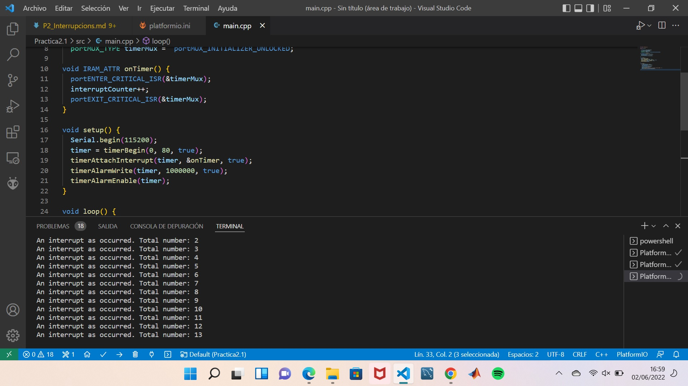

# **PRÀCTICA 2: INTERRUPCIONS**

## **PART A: Interrupció per GPIO**
## **2.1 Codi** 
El codi utilitzar per al correcte funcionament de la pràctica ha estat el següent:
```c++
#include <Arduino.h>

#define LED 16 unsigned long myTime;  
#define interruptPin 0  

void serialPin();  
void QuitarPin();

void setup() {  
// put your setup code here, to run once:  
    Serial.begin(115200);  
    pinMode(LED,OUTPUT);  
    attachInterrupt(digitalPinToInterrupt(interruptPinserialPin, FALLING));
  
}

void loop() {  
  // put your main code here, to run repeatedly:
  
    Serial.println(myTime);   // prints time since program started  
    myTime = millis();  
    while(millis()<myTime+1000);  
    // delay(1000);             
    digitalWrite(LED,HIGH);  
    Serial.println("ON");  
    myTime = millis();  
    while(millis()<myTime+500);  
    //delay(500);  
    digitalWrite(LED,HIGH);  
    Serial.println("OFF");  
    digitalWrite(LED,LOW);  
    myTime = millis();  
    while(millis()<myTime+500);  
    //delay(500);  
}

void serialPin(){  
  Serial.println("Pulsado");  
}

void QuitarPin(){  
  detachInterrupt(interruptPin);  
}

```

## **2.2 Funcionament**
S'associa la interrupció a un pin, en aquest cas al pin número 16. Aquesta interrupció s'estableix mitjançant la funció attachInterrupt en el setup. Per altra banda, al setup també s'inicialitza el pin digital com una sortida amb la comanda pinMode(led, OUTPUT).
A partir d'aquí en el loop, tenim un bucle que provoca que el LED s'encengui i s'apagui cada 500 ms. S'utilitza millis en comptes del delay, ja que és molt més eficient.
Per altra banda, a la pantalla s'imprimirà simultàniament al funcionament del LED 'ON' i 'OFF' en funció de si el LED està encès o apagat.
Per això quan es premi el polsador l'acció es pararà i tornarà al principi. A la vegada sortirà per pantalla 'polsador' per alertar de la interrupció.


## **PART B: Interrupció per Temporitzador**
## **2.4 Codi**

```c++
#include <Arduino.h>

#define LED 16
  volatile int interruptCounter;  
  int totalInterruptCounter;  
  hw_timer_t * timer = NULL;  
  portMUX_TYPE timerMux =  portMUX_INITIALIZER_UNLOCKED;

void IRAM_ATTR onTimer() {
  portENTER_CRITICAL_ISR(&timerMux);  
  interruptCounter++;
  portEXIT_CRITICAL_ISR(&timerMux);
}

void setup() {
  Serial.begin(115200);  
  timer = timerBegin(0, 80, true);  
  timerAttachInterrupt(timer, &onTimer, true);  
  timerAlarmWrite(timer, 1000000, true);  
  timerAlarmEnable(timer);  
}

void loop() {

  if (interruptCounter > 0) {
    portENTER_CRITICAL(&timerMux);
    interruptCounter--;
    portEXIT_CRITICAL(&timerMux);
    totalInterruptCounter++;  
    Serial.print("An interrupt as occurred. Total number: ");  
    Serial.println(totalInterruptCounter);  
  }
}
```

## **2.5 Funcionament**
En aquesta segona part la diferència és que ara la interrupció és causada per un temporitzador, és a dir, al cap d'un cert temps és produirà la interrupció.
En el codi podem veure com amb la funció timerattachinterrup determina la interrupció en el setup. Per altra banda, veiem que en el loop a mesura que va funcionant el programa, la interrupció s'anirà produint i aquest comptarà el nombre de cops que s'ha produït la interrupció amb el totalInterruptCounter. Finalment pel teriminal s'imprimirà el missatge "An interrupt as occurred. Total number:" fent servir les comandes: Serial.print("An interrupt as occurred. Total number: "); Serial.println(totalInterruptCounter);


